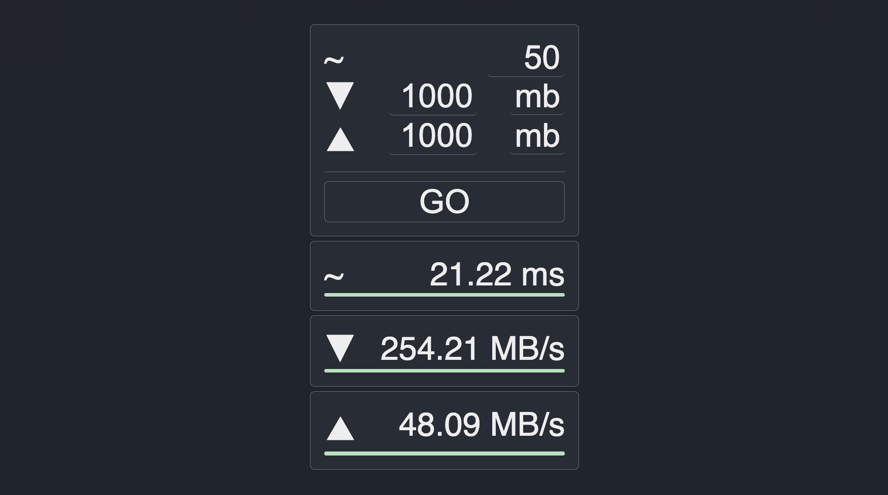

[](https://github.com/StevenCyb/SpeedTest/releases/latest)


# SpeedTest
A proof-of-concept project built in Go. With this application, you can quickly and easily measure the latency of your network connection, as well as your downstream and upstream rates.

Please note that this is a proof-of-concept project and should not be relied upon for accurate measurements.

## Web-UI
You can use the Web-UI by:
* Defining sampling rate (1-50) to measure the avg. latency
* Defining the downstream data size (1b to 1000MB) 
* Defining the upstream data size (1b to 1000MB) 
* Pressing "GO" to perform the measurement



## CLI
It is also possible to perform measurements without using a browser by using `curl`.

To **measure latency** use the following command.
```bash
curl -o /dev/null -s -w 'Connect: %{time_connect}s\nTTFB: %{time_starttransfer}s\nTotal time: %{time_total}s\n' localhost:8080/latency | awk '/Total time:/ {print $3*1000 "ms"}'
```

To **measure downstream** use the following command.
The size can be increased and decreased based on your needs.
```bash
# measure downstream
curl -o /dev/null -s -w '%{speed_download}\n' 'localhost:8080/downstream?size=500mb' | awk '{speed=$1/1024/1024; printf "%.2f MB/s\n", speed}'
```

To **measure upstream** use the following commands. 
The first one creates a junk file of 100mb and the second one performs the measurement.
```bash
# create a file with ~100mb
dd if=/dev/zero of=output.file bs=1024 count=102400
# measure upstream
curl -s -w '%{speed_upload}\n' -o /dev/null -F "file=@output.file" localhost:8080/upstream | awk '{speed=$1/1024/1024; printf "%.2f MB/s\n", speed}'
```

## Build and run
An image can be build using `docker build -t speedtest .`.
Than it can be run on docker using `docker run --name speedtest -p 8080:8080 speedtest`.